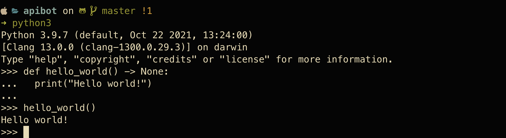
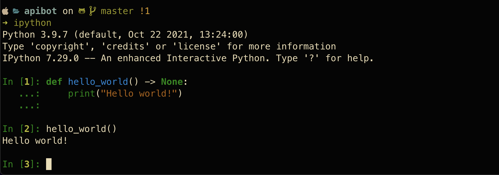

# Clash API Developers - Getting Started with Python
## Table of Content
1. [Why choose python](#1)
2. [Learning Python Resources](#2)
3. [Python toolchain](#3)
   1. [Python Interpreter(iPython)](#3.1)
   2. [IDE](#3.2)

## Why Choose Python 
Python has been the top 5 language for the last few years because of it's ease of use and dedicated community. With a 
language backed by a strong community you can expect a ton of documentation on the language and the various libraries
created for the language. 

## Learning Python Resources 
There is a ton of resources for Python considering how much traction it has lately. A book that we highly recommend
is the [Python Crash Course](https://www.amazon.com/Python-Crash-Course-Hands-Project-Based/dp/1593276036). This book
will get you started writing little projects to get you comfortable with the language. It is important when learning 
a news language, to spend time building up your skills. It will not benefit you to learn a new language AND learn 
several APIs like discord.py and coc.py. 

An additional resource for learning python that is free is using youtube. Some of our favorite YouTube teachers include:
- [Python Tutorial - Python for Beginners [Full Course]](https://www.youtube.com/watch?v=_uQrJ0TkZlc&t=90s)
- [Python Programming](https://pythonprogramming.net)

## Python toolchain 
A toolchain is just a fancy developer word for describing a set of tools you use to make your developing experience 
easier and faster. For someone starting as a new developer, it may be confusing to add tools to your chain. It is 
recommended to add them as you need them. You will know when you need it when you start complaining about how 
repetitive or tedious it is to perform some task that you are working on. The following are recommended tools for 
your chain when it comes to developing in python. 

### Python Interpreter (iPython) 
Python comes with an incredible interpreter environment, this environment is invoked by python "Python" in the 
terminal. This is the go-to place to quickly mock up a function or a one-liner to make sure it works before adding 
it to your application. Not all languages support this type of environment, so be sure to take advantage! With that 
being said, the default interpreter environment can be pretty crude especially when you start mocking up complex 
functions. Any mistake you make in your function requires you to re-write the function or play with the up arrow + 
enter. 

This is where iPython comes in. iPython is the interpreter engine behind the vastly popular Jupyter notebooks. 
iPython is a mix between an interpreter environment and a text editor. If you make a mistake with your function, you 
can up arrow and scroll through the function as if it was in a text editor. It makes mocking up your code extremely 
easy!

### IDE 
An Integrated Development Environment differs from a text editor by providing at a minimum, analytical features to 
point out when you are writing your logic incorrectly or against style guides. It is crucial when learning a language 
to practice good design patterns and coding to a standard. If you start learning without a style guide, it may become 
harder for your peers to read your code. A good way to learn a standard is by allowing your IDE to point out when you 
are making a mistake. 

Two free tools that are currently recommended for Python developers at the time of this writing are Visual Studio 
Code with Python and Pylance plugins and PyCharm Community Edition. 
